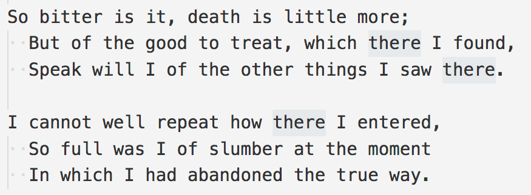

# cursory-glance README

VSCode extension that highlights the cursors when there are more than of them.

## Features

I found myself forgetting the multi-cursor feature on, and editing multiple places by accident. So I wrote this package that annotates the cursor with the number of cursors. The extension is activated when the user creates multiple selections with e.g. `cmd-d`.

## Extension Settings

No settings for now.

## Known Issues

- I wasn't able to find a non-hacky method for adding "absolutely positioned" UI elements where the cursor is. The current method dictates a non-optimal placement for the badges, and it might cause a single character to jump a pixel or two horizontally. Also, the badge doesn't show properly when its cursors near the beginning of line.

- If there are more than nine cursors, only `*` is shown in the badge. That's just laziness.

## Release Notes

### 0.1.0

Initial release.
